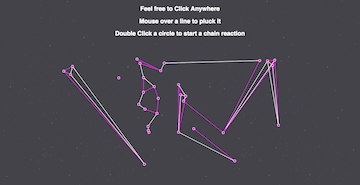

#algoMusic

## The Project

algoMusic is a single page app built with JavaScript, D3.js, and Timber.js! Click [algoMusic](https://yamikamisama.github.io/algoMusic) to play! 
* A single click on the page will place a node
* If you add nodes nearby eachother they will connect.
* Hover over the line connecting the two to pluck the note
* Click and drag a circle to make the connection longer/shorter
* Double Click a circle to set off a chain reaction

##Team Members

####Ashi
* GitHub: https://github.com/queerviolet

####Michael Angelo
* GitHub: https://github.com/Yamikamisama
* LinkedIn: http://www.linkedin.com/pub/michael-angelo/9a/a93/1b0/
* Email: yamikamisama@gmail.com

####Matt Weckel
* GitHub: https://github.com/mrweckel
* LinkedIn: https://www.linkedin.com/pub/matt-weckel/75/397/aa4
* Email: mrweckel@gmail.com
